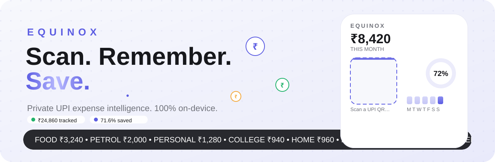
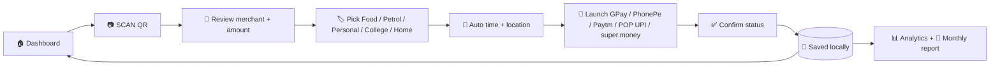
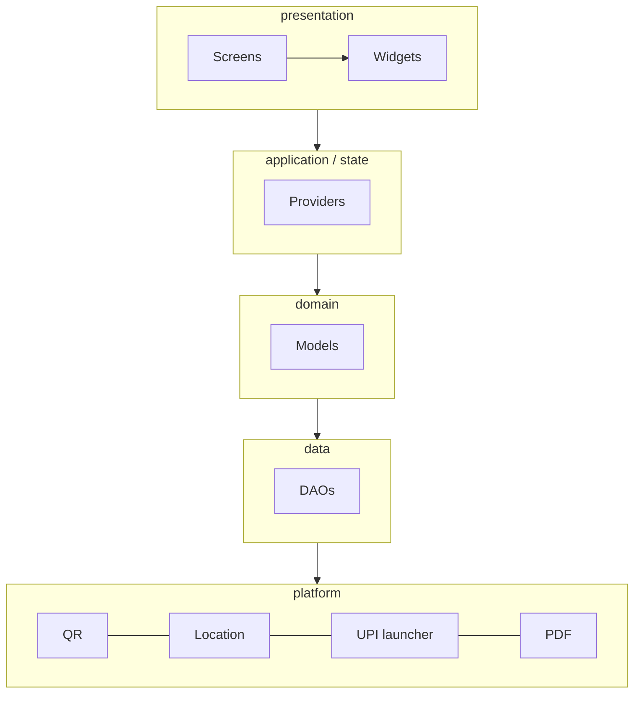

<p align="center">
  
</p>

<p align="center">
  
  
  
  
  
  
  
  
</p>

<h3 align="center">Scan your payment. Remember every detail.<br/>Understand your spending. Build your savings. Keep it yours.</h3>

<p align="center">
  <b>Equinox</b> is a private, <b>local-only</b> personal finance app for Android.<br/>
  No account. No server. No sync. Your UPI data <b>never leaves your phone</b>.
</p>

<p align="center">
  ⛔&nbsp; No Supabase &nbsp;•&nbsp; ⛔&nbsp; No Firebase &nbsp;•&nbsp; ⛔&nbsp; No backend &nbsp;•&nbsp; ⛔&nbsp; No login &nbsp;•&nbsp; ✅&nbsp; 100% offline
</p>

---

## ⚡ The one-tap loop



> Manual work per payment: **pick a category** (+ optional note). Everything else — merchant, UPI ID, time, location — is captured automatically.

## 📱 Screens

| Home | History | Scan → Pay | Analytics | Profile |
|---|---|---|---|---|
| Total / month / week spending, savings vs target with animated progress, category breakdown, weekly bars, recent transactions, report teaser | Instant search across merchant · UPI ID · note · reference · category, All + 5 category chips, Today / Week / Month / Custom range, day-grouped list, full detail sheet per transaction | Full-screen scanner → review → category → auto timestamp/location → UPI app picker with installed detection → reconcile (Phase 3) | Weekly chart, monthly view, category drill-down (Phase 4) | Local profile, savings target, data management: CSV / JSON export, JSON restore, delete-all (Phase 6) |

## 📊 Live snapshot (seed data)

| | |
|---|---|
| **Total spending** | ₹24,860 |
| **September 2026** | ₹8,420 — Food ₹3,240 · Petrol ₹2,000 · Personal ₹1,280 · College ₹940 · Home ₹960 |
| **Week Sep 21–27** | ₹2,150 |
| **Saved (September)** | ₹3,580 / ₹5,000 — **71.6 %**, ₹1,420 remaining |

Only `SUCCESSFUL` transactions count as spending. `PENDING` / `UNKNOWN` stay separated, `FAILED` / `CANCELLED` never inflate totals. Savings are **explicit contributions only** — the app never pretends to know your bank balance.

## 🧱 Stack

| Layer | Choice |
|---|---|
| Framework / language | Flutter 3.47 · Dart 3.13 · Material 3 |
| State | Riverpod |
| Database | SQLite via Drift (+ `drift_flutter`), `flutter_secure_storage` for secrets |
| Device | Camera (QR) · Fused location (single capture per transaction) · Android Intents / UPI deep links · installed-app detection |
| Reports | On-device PDF generation, manual share only |



> Native Android code lives in `platform/` — never inside widgets.

## 🗺️ Roadmap — 6 phases (`docs/PHASES.md` is law)

- [x] **Phase 1 — Foundation & Design System.** Scaffold, M3 theme, Drift schema (6 tables + indexes), nav shell, reusable widgets, seed.
- [x] **Phase 2 — Dashboard & Spending.** Dashboard, search + filters + grouping, detail sheet, weekly bars, DAO surface + tests.
- [x] **Phase 3 — QR → UPI Payment Flow.** Scanner, UPI parsing, 5 categories, auto time/location, 5-app launcher, status machine, local persistence.
- [x] **Phase 4 — Savings & Analytics.** Targets, goals, weekly/monthly/category analytics.
- [x] **Phase 5 — Monthly Reports.** Auto-derived archive, detail, on-device PDF + share.
- [x] **Phase 6 — Reliability, Backup & Final Polish.** Pending inbox, CSV/JSON export, JSON restore, delete-all, release signing, integration test green.

After every phase: verify → test → update `PHASES.md` + `CHANGELOG.md` → fix before continuing.

## 🚀 Quickstart

```powershell
# toolchain (Windows, per-user via scoop)
scoop install flutter temurin17-jdk android-clt
flutter doctor --android-licenses

# run
flutter pub get
dart run build_runner build --delete-conflicting-outputs
flutter run

# verify
flutter analyze        # clean
flutter test           # 16/16

# release APKs for your phone
flutter build apk --release                 # build/app/outputs/flutter-apk/app-release.apk
flutter build apk --release --split-per-abi # -arm64-v8a- for modern phones
```

## 📁 Structure

```
lib/
  core/theme/       # M3 tokens — bg #F7F8FC · card #FFFFFF · primary #5B5CE2
  core/format/      # Indian currency (₹1,24,500)
  core/widgets/     # SpendingCard · SavingsProgress · TxDetailSheet · SpendingChart …
  domain/           # Category (exactly 5) · PayStatus (7 states) · seed
  data/db/          # Drift schema + DAO queries (status-filtered, indexed)
  application/      # Riverpod providers + filter/search/group logic
  presentation/     # onboarding · home · history · scan · analytics · profile
  platform/         # QR · location · UPI intents (Phase 3+)
test/               # spending_test · db_test (real SQLite) · widget_test
docs/               # PHASES.md · CHANGELOG.md
release/            # Equinox-v1.0.0-release.apk · Equinox-v1.0.0-arm64.apk (local, gitignored)
```

## 🔒 Privacy & safety

- ✈️ Fully offline — every feature works with radios off.
- 📍 Location captured **once per transaction**, never tracked. Denied permission → `"Location unavailable"`, flow continues.
- 🚫 Never touches UPI PINs, bank passwords, or OTPs. Never auto-marks success. Never silently pays.
- 💾 No cloud backup — encrypted local settings, checksummed JSON export + restore, explicit delete-all.

---

<p align="center"><b>EQUINOX — Your payments. Remembered.</b></p>
<p align="center"><sub>Bright · calm · premium · frictionless. Built phone-first, for keeps.</sub></p>
